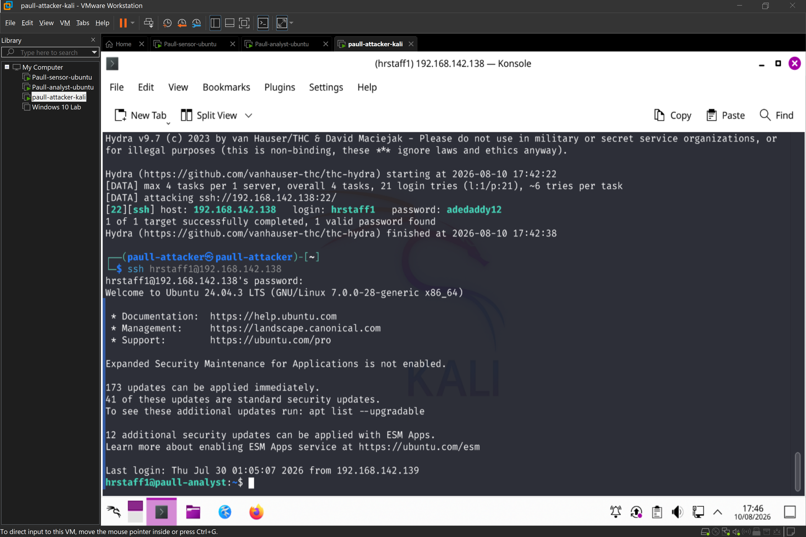
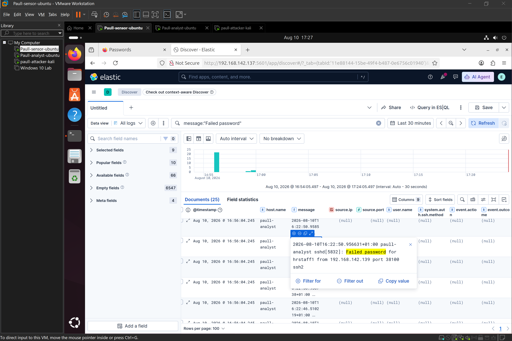
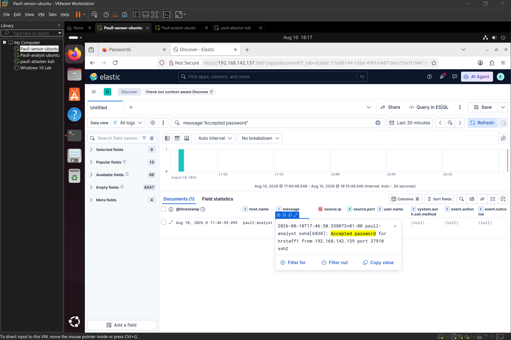
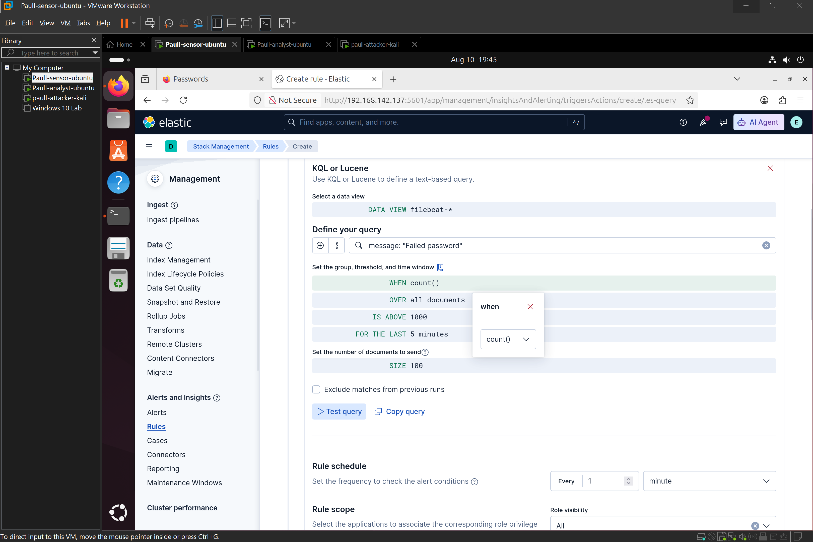
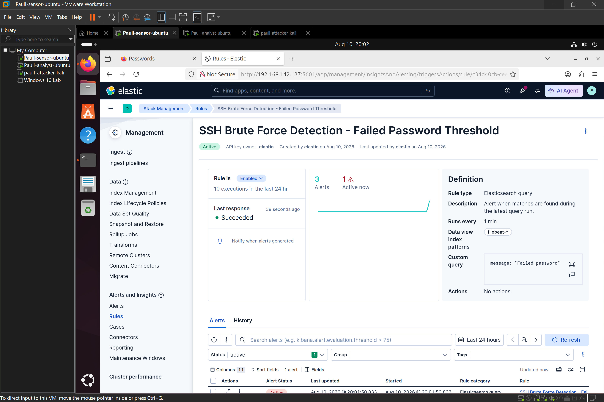

 # SIEM-Alert-Triage-with-ELK-Stack
 # Objective
 Centralize logs from a victim host into a SIEM (Elasticsearch + Kibana + Filebeat), simulate an attack, detect it through log analysis, build an automated alert rule, and triage the resulting alert — replicating a real SOC analyst workflow from log ingestion to incident write-up.
 # Environment
 | Role    | Host name     |   Tool stack
 | :---:      | :---:      | :---:
 | Attacker  | Paull-attacker-kali | Kali linux, Hydra.
 | Victim | paull-analyst | Ubuntu servver, OpenSSH, Filebeat
 | Siem | paull - sensor | Ubuntu server, ElasticSearch, kibana 
  * Note - All three VMs run in VMware Workstation on an isolated internal network. Private IP ranges shown in screenshots are lab-only and safe to publish.

    # Architecture
    [Kali - Attacker] --SSH brute force--> [Ubuntu-Victim] --Filebeat--> [Elasticsearch/Kibana - SIEM]

    # Setup Summary
  1. Elasticsearch + Kibana installed on the SIEM host, configured for single-node operation with xpack.security enabled (username/password auth) and server.host: 0.0.0.0 to allow remote access.

2. Filebeat installed on the victim host, configured with a filestream input (Filebeat 9.x deprecated the legacy log input type) shipping /var/log/auth.log and /var/log/syslog to Elasticsearch
Note: logs land in Elasticsearch as unparsed text in the message field (the Filebeat system module, which extracts structured fields like source.ip, was not yet enabled at this stage — however as i continue to use ELK i will keep improving my SIEM so as to replicate a standard SOC SIEM setup).   
 
# Attack Simulation 
Tool: Hydra: Command  - ```hydra -l hrstaff1 -P <wordlist>.txt ssh://192.168.142.138```
This generated a burst of authentication attempts against the victim's SSH service, visible in Kibana Discover within seconds of execution. 

# Detection - Kibana Discover 
Query used to isolate brute-force activity: ```message: "failed password"```.

 sample raw log entry:
paull-analyst sshd[6464]: Failed password for hrstaff1 from 192.168.142.139 port 40438 ssh2.

Both Failed password  and a single Accepted password entry were visible, confirming the tool eventually succeeded once it reached the correct credential in the wordlist — mirroring what a real brute-force compromise looks like in logs.




# Alert Rule
Built as a native Kibana Elasticsearch query rule (Stack Management → Rules and Connectors):

| Setting   |  Value |
| :---: | :---: |
Rule type	 | Elasticsearch query
Data view | 	filebeat-*
Query |	message: "Failed password"
Threshold | 	count() IS ABOVE 5
Time window	 | 1 minute
Check frequency	 | Every 1 minute

Actions	None configured (no notification connector in lab environment)

Conceptual logic:
IF count(Failed password) > 5 WITHIN 60 seconds
THEN raise alert "Possible SSH Brute Force"
SEVERITY = Medium


The rule was validated by re-running Hydra and confirming the rule's test query returned a non-zero match count, then confirming an alert instance appeared under Alerts and Insights → Alerts.


# IOC Table
IOC Type | 	Value | 	Context | 
| :---: | :---: | :---: |
Source IP | 	192.168.142.139 |	Brute-force origin (Kali attacker host)
Target IP | 	paull-analyst (victim host) | 	SSH brute-force target
Target service | 	SSH (port 22) | 	Brute-force target service
Target account	| hrstaff1 | 	Account targeted in wordlist attack
Pattern |	High-volume Failed password entries within a short window	| Indicative of automated credential-stuffing/brute-force tool
Tool signature | 	Rapid sequential auth attempts, short-lived connections | 	Consistent with Hydra's connection behavior

# Triage Note

Alert: SSH Brute Force Detected

Host: paull-analyst (Ubuntu-Victim)

Source IP: 192.168.142.139

Timestamp: 2026-08-10 6:22:50

Failed Attempt Count: 3

Successful Attempt: 1

Verdict: True Positive

Severity: Medium

Next Steps:
  - Block source IP at host/network firewall level
  - Enable fail2ban on the victim host to auto-block repeat offenders
  - Review the targeted account (hrstaff1) for any signs of successful compromise ( which was found )
  - Enforce SSH key-based authentication going forward to eliminate password-guessing risk

# Key Takeaway
This lab highlights a core SIEM limitation and its mitigation: encrypted protocols like SSH don't reveal why a connection succeeded or failed at the network layer — but host-generated application logs (auth.log) do.
Centralizing those logs and applying a simple threshold-based rule is enough to catch a live brute-force attack in near real-time, without needing to inspect packet contents. 
This is standard SOC Tier-1 triage methodology: correlate a detection (the alert) with the underlying evidence (the raw log line) to reach a verdict.

# Documented improvement for future iteration

the Filebeat system module ```(filebeat modules enable system)``` was not enabled during this lab, meaning ```source.ip``` exists only as unstructured text inside message rather than a proper structured field.
Enabling this module would allow the alert rule to group by ```source.ip``` directly, supporting per-attacker tracking and more precise alerting — a natural next step for this environment.
